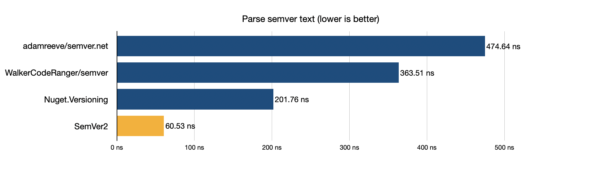

# SemVer2
 Fast C# Implementation of Semantic Versioning 2.0 for .NET

[](https://www.nuget.org/packages/SemVer2)
[](https://github.com/nuskey8/SemVer2/releases)
[](LICENSE)

[English]((./README.md)) | 日本語

## 概要

SemVer2は.NET向けのハイパフォーマンスなSemantic Versioning 2.0実装です。`ISpanFormattable`/`ISpanParsable<T>`などの現代的なインターフェースに対応し、[semver](https://github.com/WalkerCodeRanger/semver)や[Nuget.Versioning](https://www.nuget.org/packages/NuGet.Versioning)などのライブラリよりも高速に動作することを念頭に設計されています、



また、System.Text.Jsonや[MessagePack-CSharp](https://github.com/MessagePack-CSharp/MessagePack-CSharp)向けの拡張が用意されているほか、.NET Toolとして利用可能なCLIツールも提供されています。

## インストール

### NuGet packages

SemVer2を利用するには.NET Standard2.1以上が必要です。パッケージはNuGetから入手できます。

### .NET CLI

```ps1
dotnet add package SemVer2
```

### Package Manager

```ps1
Install-Package SemVer2
```

## 使い方

`SemVer`構造体を用いてSemantic Versioningを扱うことができます。

```cs
var semver = SemVer.Create(1, 0, 0, "alpha", "001");
Console.WriteLine(semver);            // 1.0.0-alpha+001
Console.WriteLine(semVer.Major);      // 1
Console.WriteLine(semVer.Minor);      // 0
Console.WriteLine(semVer.Patch);      // 0
Console.WriteLine(semVer.Prerelease); // alpha
Console.WriteLine(semVer.Build);      // 001
```

また、`SemVer`は`ISpanFormattable`,`ISpanParsable<T>`,`IUtf8SpanFormattable`,`IUtf8SpanParsable<T>`を実装しており、UTF-16/UTF-8文字列と相互に変換することが可能です。

```cs
var semver = SemVer.Parse("1.0.0-alpha+001");

Span<char> buffer = stackalloc char[15];
semver.TryFormat(buffer, out var charsWritten);
```

`SemVer`は`IComparable<T>`を実装しているほか、比較演算子(`>`,`<`,`>=`,`<=`)のオーバーロードが用意されており、これらの演算子を用いて各バージョンを比較することができます。

```cs
var a = SemVer.Parse("1.0.0");
var b = SemVer.Parse("1.0.1");
var c = SemVer.Parse("1.0.0-alpha");

Console.WriteLine(a < b); // True
Console.WriteLine(a < c); // False
```

## System.Text.Json

`SemVer`にはSystem.Text.Json向けに`SemVerJsonConverter`が提供されています。これは.NET Core 3.0以降では組み込みで追加されているほか、.NET Standard 2.1では[SemVer2.SystemTextJson](https://www.nuget.org/packages/SemVer2.SystemTextJson/)パッケージを追加することで利用が可能です。

```ps1
Install-Package SemVer2.SystemTextJson
```

```cs
var options = new JsonSerializerOptions()
{
    Converters =
    {
        new SemVerJsonConverter()
    }
};

JsonSerializer.Serialize(SemVer.Parse("1.0.0"), options);
```

## MessagePack-CSharp

同様に[MessagePack-CSharp](https://github.com/MessagePack-CSharp/MessagePack-CSharp)向けに`SemVerMessagePackFormatter`および`SemVerMessagePackResolver`が提供されています。これはは[SemVer2.MessagePack](https://www.nuget.org/packages/SemVer2.MessagePack/)パッケージを追加することで利用が可能です。

```ps1
Install-Package SemVer2.MessagePack
```

```cs
var resolver = MessagePack.Resolvers.CompositeResolver.Create(
    SemVerMessagePackResolver.Instance,
    MessagePack.Resolvers.StandardResolver.Instance);
var options = MessagePackSerializerOptions.Standard.WithResolver(resolver);

MessagePackSerializer.Serialize(SemVer.Parse("1.0.0"), options);
```

## CLI

SemVer2では[node-semver](https://github.com/npm/node-semver)のようにコマンドラインでバージョンの検証やインクリメントを行える.NET Toolが提供されています。

```
dotnet tool install --global SemVer2.Cli
```

以下のように利用できます。

```bash
$ dotnet semver 1.2.3
1.2.3
$ dotnet semver foo

$ dotnet semver 1.0.0 -i patch
1.0.1

$ dotnet semver 1.0.0,1.0.1,1.0.0-alpha
1.0.0-alpha
1.0.0
1.0.1
```

コマンドの詳細は以下の通りです。

```
Usage: [arguments...] [options...] [-h|--help] [--version]

Prints valid versions sorted by SemVer precedence

Arguments:
  [0] <string[]>

Options:
  -i|--increment <string?>    Increment a version by the specified level. (major | minor | patch | prerelease | release) (Default: null)
  --preid <string?>           Identifier to be used to prerelease version increments. (Default: null)
```

## パフォーマンス

ベンチマークの結果は以下の通りです。

### Parse (`1.2.3`)

| Method                  |      Mean |    Error |   StdDev |
| ----------------------- | --------: | -------: | -------: |
| adamreeve/semver.net    | 306.70 ns | 6.142 ns | 5.746 ns |
| WalkerCodeRanger/semver | 186.98 ns | 2.114 ns | 1.650 ns |
| Nuget.Versioning        |  97.16 ns | 1.245 ns | 0.972 ns |
| SemVer2                 |  25.85 ns | 0.541 ns | 1.464 ns |

### Parse (`1.0.0-beta+exp.sha.5114f85`)

| Method                  |      Mean |    Error |   StdDev |
| ----------------------- | --------: | -------: | -------: |
| adamreeve/semver.net    | 474.64 ns | 1.458 ns | 1.139 ns |
| WalkerCodeRanger/semver | 363.51 ns | 2.213 ns | 2.070 ns |
| Nuget.Versioning        | 201.76 ns | 1.612 ns | 1.346 ns |
| SemVer2                 |  60.53 ns | 0.592 ns | 0.525 ns |

### ToString (`1.0.0-beta+exp.sha.5114f85`)

| Method                  |      Mean |    Error |   StdDev |    Median |
| ----------------------- | --------: | -------: | -------: | --------: |
| adamreeve/semver.net    | 194.92 ns | 0.915 ns | 0.856 ns | 195.11 ns |
| WalkerCodeRanger/semver |  67.94 ns | 2.613 ns | 7.703 ns |  63.78 ns |
| Nuget.Versioning        |  37.58 ns | 0.783 ns | 1.599 ns |  37.24 ns |
| SemVer2                 |  20.79 ns | 0.166 ns | 0.139 ns |  20.79 ns |

## ライセンス

このライブラリは[MIT License](./LICENSE)の下で公開されています。